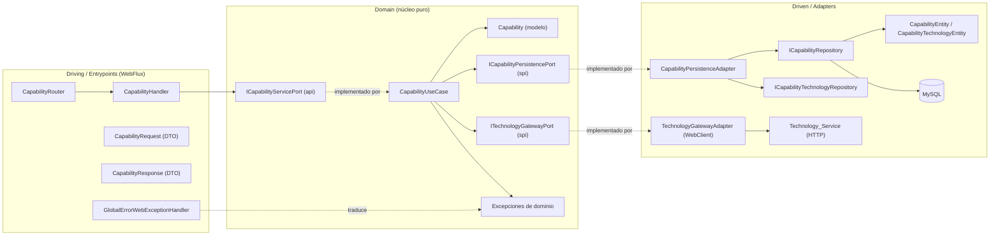
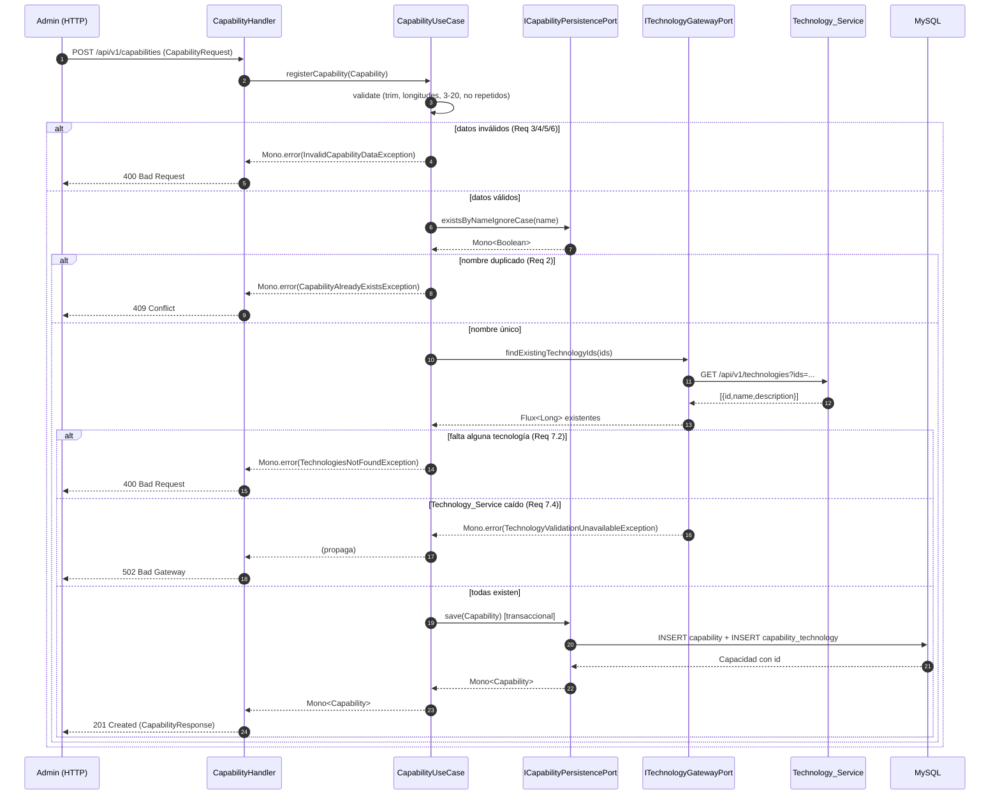

# Documento de Diseño: Registrar Capacidades

## Overview

Este documento describe el diseño técnico de la HU 2 - Registrar Capacidades del microservicio de Capacidad. El servicio es un microservicio **reactivo** e independiente construido con **Java 17, Spring Boot 3 y Spring WebFlux**, que persiste datos en **MySQL** de forma no bloqueante mediante **Spring Data R2DBC** (driver `io.asyncer:r2dbc-mysql`). Se construye con **Gradle** y sigue una **arquitectura hexagonal estricta** (puertos y adaptadores), replicando el enfoque del microservicio de referencia `microservicio_tecnologia`.

El objetivo funcional es exponer un endpoint `POST /api/v1/capabilities` que:

1. Recibe un DTO de solicitud con `name`, `description` y `technologyIds`.
2. Valida obligatoriedad y longitudes (nombre 1-50, descripción 1-90) de forma reactiva.
3. Valida la cantidad (3-20) y no repetición de las tecnologías asociadas.
4. Valida que el nombre sea único (comparación case-insensitive y con trim).
5. Valida que todas las tecnologías existan, consultando al microservicio de Tecnología vía `WebClient`.
6. Persiste la capacidad y sus asociaciones en MySQL, de forma transaccional y sin bloquear.
7. Retorna `201 Created` con la capacidad creada, o los errores `400` / `409` / `502` correspondientes.

Cubre los Requerimientos 1 a 9 de `requirements.md`.

### Relación entre microservicios (por qué WebClient)

Las tecnologías son propiedad del microservicio de Tecnología y viven en su propia base de datos. Cumpliendo la regla del reto ("cada microservicio persiste únicamente su base de datos"), el microservicio de Capacidad **no** duplica el catálogo de tecnologías: persiste solo los `technologyId` en una tabla puente y consulta al de Tecnología cuando necesita validar existencia o enriquecer con nombres.

Esta consulta se hace con **`WebClient`**, el cliente HTTP reactivo y no bloqueante de Spring (estándar del proyecto en lugar de `RestTemplate`, que es bloqueante). El microservicio de Tecnología expone `GET /api/v1/technologies?ids=1,2,3`, que devuelve solo las tecnologías existentes; comparando la cantidad solicitada con la devuelta, Capacidad detecta identificadores inexistentes.

### Por qué programación reactiva (contexto de aprendizaje)

La programación reactiva permite manejar I/O (consultas a BD y llamadas HTTP a otros microservicios) **sin bloquear el hilo** que atiende la petición. Aquí es especialmente relevante porque el registro combina dos fuentes de I/O: la base de datos (R2DBC) y una llamada HTTP saliente (`WebClient`). Ambas se componen en un solo pipeline `Mono`/`Flux` sin `.block()`.

- **`Mono<T>`**: 0 o 1 elemento. El registro de una capacidad retorna `Mono<Capability>`.
- **`Flux<T>`**: 0 a N elementos. La consulta de tecnologías existentes retorna `Flux<TechnologyId>` (o similar) desde el gateway.

Regla de oro: **nunca `.block()`**. Todo se encadena con operadores (`map`, `flatMap`, `collectList`, `filterWhen`, `switchIfEmpty`, `onErrorMap`), y el framework se suscribe al pipeline al recibir la petición (Requerimiento 8).

### Decisiones arquitectónicas y su justificación

| Decisión | Justificación |
| --- | --- |
| Arquitectura hexagonal estricta | Aísla las reglas de negocio del framework. Replica `microservicio_tecnologia`. |
| Modelo de dominio puro (`Capability`) sin anotaciones | Evita acoplar la lógica a R2DBC/Jackson. El mapeo ocurre en los adaptadores. |
| Persistir solo `technologyId` (no el nombre) | Respeta que cada microservicio persista únicamente su BD. El catálogo es propiedad del de Tecnología. |
| Tabla puente `capability_technology` | Modela la relación N:M entre capacidad y tecnologías dentro de la BD de Capacidad. |
| Validación de existencia vía `WebClient` (puerto SPI `ITechnologyGatewayPort`) | El dominio depende de una abstracción, no de HTTP. El adaptador `TechnologyGatewayAdapter` implementa la llamada real. |
| `WebClient` en vez de `RestTemplate` | `WebClient` es no bloqueante y se compone con el pipeline reactivo (Req 8.3). |
| Excepciones de dominio custom + handler global | Reglas de negocio emiten excepciones semánticas sin conocer HTTP; el handler global traduce a 400/409/502. |
| Validaciones en el usecase (dominio) | Obligatoriedad, longitudes, cantidad, no-repetición y existencia son reglas de negocio. |
| `TransactionalOperator` programático en el adaptador driven | Mantiene el dominio libre de anotaciones de Spring; la persistencia de capacidad + asociaciones es atómica (Req 1.2). |

## Architecture

El sistema se organiza en tres regiones de la arquitectura hexagonal: **driving** (adaptadores de entrada), **domain** (núcleo), y **driven** (adaptadores de salida: R2DBC y el gateway HTTP). Las dependencias apuntan siempre **hacia el dominio**.



### Capas y responsabilidades

- **Driving (WebFlux):** `CapabilityRouter` declara `POST /api/v1/capabilities` y la asocia a `CapabilityHandler`. El handler deserializa `CapabilityRequest`, delega en `ICapabilityServicePort`, mapea el resultado a `CapabilityResponse` y construye la respuesta `201`. Los errores se propagan al handler global.
- **Domain (núcleo):** `CapabilityUseCase` implementa `ICapabilityServicePort` y contiene todas las reglas. Depende de dos puertos de salida: `ICapabilityPersistencePort` (persistencia) e `ITechnologyGatewayPort` (validación de existencia). El modelo `Capability` es puro.
- **Driven (R2DBC):** `CapabilityPersistenceAdapter` implementa `ICapabilityPersistencePort` usando dos repositorios (`ICapabilityRepository` y `ICapabilityTechnologyRepository`) y envuelve la escritura en una transacción reactiva.
- **Driven (Gateway HTTP):** `TechnologyGatewayAdapter` implementa `ITechnologyGatewayPort` usando `WebClient` contra `GET /api/v1/technologies?ids=...`.
- **Application/config:** `BeanConfiguration` cablea usecase + adaptadores; `R2dbcConfig` la transaccionalidad; `WebClientConfig` el `WebClient`; `OpenApiConfiguration` la doc.

### Estructura de paquetes propuesta

```
com.bootcamp.capability
├── domain
│   ├── model
│   │   └── Capability.java
│   ├── api
│   │   └── ICapabilityServicePort.java
│   ├── spi
│   │   ├── ICapabilityPersistencePort.java
│   │   └── ITechnologyGatewayPort.java
│   ├── usecase
│   │   └── CapabilityUseCase.java
│   └── exception
│       ├── CapabilityAlreadyExistsException.java
│       ├── InvalidCapabilityDataException.java
│       ├── TechnologiesNotFoundException.java
│       ├── TechnologyValidationUnavailableException.java
│       └── DomainErrorCode.java
├── infrastructure
│   └── adapters
│       ├── driven
│       │   ├── r2dbc
│       │   │   ├── entity/{CapabilityEntity, CapabilityTechnologyEntity}.java
│       │   │   ├── repository/{ICapabilityRepository, ICapabilityTechnologyRepository}.java
│       │   │   ├── adapter/CapabilityPersistenceAdapter.java
│       │   │   └── mapper/CapabilityEntityMapper.java
│       │   └── http
│       │       ├── TechnologyGatewayAdapter.java
│       │       └── dto/TechnologyGatewayResponse.java
│       └── driving
│           └── webflux
│               ├── router/CapabilityRouter.java
│               ├── handler/CapabilityHandler.java
│               ├── dto/{CapabilityRequest, CapabilityResponse, ErrorResponse}.java
│               ├── mapper/CapabilityDtoMapper.java
│               └── exception/GlobalErrorWebExceptionHandler.java
└── application
    └── config
        ├── BeanConfiguration.java
        ├── R2dbcConfig.java
        ├── WebClientConfig.java
        └── OpenApiConfiguration.java
```

## Components and Interfaces

### Modelo de dominio

```java
// domain/model/Capability.java — clase pura, inmutable, sin anotaciones
public final class Capability {
    private final Long id;                 // null antes de persistir
    private final String name;
    private final String description;
    private final List<Long> technologyIds; // identificadores asociados (distintos)
    // constructor + getters; sin setters
}
```

### Puerto de entrada (api)

```java
// domain/api/ICapabilityServicePort.java
public interface ICapabilityServicePort {
    Mono<Capability> registerCapability(Capability capability);
}
```

### Puertos de salida (spi)

```java
// domain/spi/ICapabilityPersistencePort.java
public interface ICapabilityPersistencePort {
    Mono<Boolean> existsByNameIgnoreCase(String normalizedName);
    Mono<Capability> save(Capability capability); // persiste capacidad + asociaciones (transaccional)
}

// domain/spi/ITechnologyGatewayPort.java
public interface ITechnologyGatewayPort {
    // Emite los ids que SÍ existen en el Technology_Service (subconjunto de los solicitados).
    Flux<Long> findExistingTechnologyIds(Collection<Long> ids);
}
```

### Caso de uso

```java
// domain/usecase/CapabilityUseCase.java
public class CapabilityUseCase implements ICapabilityServicePort {

    private static final int NAME_MAX_LENGTH = 50;
    private static final int DESCRIPTION_MAX_LENGTH = 90;
    private static final int MIN_TECHNOLOGIES = 3;
    private static final int MAX_TECHNOLOGIES = 20;

    private final ICapabilityPersistencePort persistencePort;
    private final ITechnologyGatewayPort technologyGatewayPort;

    @Override
    public Mono<Capability> registerCapability(Capability capability) {
        return validate(capability)                       // Mono<Capability> normalizado | Mono.error(400)
            .flatMap(this::ensureNameIsUnique)            // | Mono.error(409)
            .flatMap(this::ensureTechnologiesExist)       // consulta gateway | Mono.error(400/502)
            .flatMap(persistencePort::save);              // persiste solo si todo pasó
    }
    // validate: trim + obligatoriedad + longitudes + cantidad (3-20) + no repetidos
    // ensureNameIsUnique: existsByNameIgnoreCase
    // ensureTechnologiesExist: gateway.findExistingTechnologyIds + comparación de conjuntos
}
```

### Adaptador de persistencia (driven / R2DBC)

Persiste en dos tablas dentro de una transacción reactiva: primero `capability` (obtiene el id generado), luego las filas de `capability_technology`.

```java
@Override
public Mono<Capability> save(Capability capability) {
    Mono<Capability> pipeline = capabilityRepository
        .save(mapper.toEntity(capability))                        // Mono<CapabilityEntity> con id
        .flatMap(saved -> {
            List<CapabilityTechnologyEntity> links = capability.getTechnologyIds().stream()
                .map(techId -> new CapabilityTechnologyEntity(saved.getId(), techId))
                .toList();
            return capabilityTechnologyRepository.saveAll(links)   // Flux<...>
                .then(Mono.just(mapper.toDomain(saved, capability.getTechnologyIds())));
        })
        .onErrorMap(DataIntegrityViolationException.class,
            ex -> new CapabilityAlreadyExistsException(capability.getName()));
    return pipeline.as(transactionalOperator::transactional);      // commit/rollback atómico
}
```

### Adaptador gateway (driven / HTTP con WebClient)

```java
// infrastructure/adapters/driven/http/TechnologyGatewayAdapter.java
public class TechnologyGatewayAdapter implements ITechnologyGatewayPort {
    private final WebClient webClient; // baseUrl del Technology_Service

    @Override
    public Flux<Long> findExistingTechnologyIds(Collection<Long> ids) {
        if (ids == null || ids.isEmpty()) return Flux.empty();
        String csv = ids.stream().map(String::valueOf).collect(Collectors.joining(","));
        return webClient.get()
            .uri(uri -> uri.path("/api/v1/technologies").queryParam("ids", csv).build())
            .retrieve()
            .bodyToFlux(TechnologyGatewayResponse.class)  // {id, name, description}
            .map(TechnologyGatewayResponse::id)
            .onErrorMap(ex -> new TechnologyValidationUnavailableException(ex)); // -> 502
    }
}
```

### DTOs y mappers (driving)

```java
public record CapabilityRequest(String name, String description, List<Long> technologyIds) {}
public record CapabilityResponse(Long id, String name, String description, List<Long> technologyIds) {}
public record ErrorResponse(int status, String code, String message, Instant timestamp) {}
```

### Handler y Router (driving)

```java
public Mono<ServerResponse> register(ServerRequest request) {
    return request.bodyToMono(CapabilityRequest.class)
        .map(dtoMapper::toDomain)
        .flatMap(servicePort::registerCapability)
        .map(dtoMapper::toResponse)
        .flatMap(resp -> ServerResponse.status(HttpStatus.CREATED)
            .contentType(MediaType.APPLICATION_JSON).bodyValue(resp));
}
```

```java
@Bean
public RouterFunction<ServerResponse> capabilityRoutes(CapabilityHandler handler) {
    return RouterFunctions.route()
        .POST("/api/v1/capabilities", accept(MediaType.APPLICATION_JSON), handler::register)
        .build();
}
```

## Data Models

### Modelo de dominio `Capability`

| Campo | Tipo | Notas |
| --- | --- | --- |
| `id` | `Long` | `null` antes de persistir; asignado por MySQL. |
| `name` | `String` | Normalizado (trim). 1-50 caracteres. |
| `description` | `String` | Normalizada (trim). 1-90 caracteres. |
| `technologyIds` | `List<Long>` | Identificadores distintos, entre 3 y 20; validados como existentes. |

### Esquema de tablas MySQL

```sql
CREATE TABLE IF NOT EXISTS capability (
    id          BIGINT       NOT NULL AUTO_INCREMENT,
    name        VARCHAR(50)  NOT NULL,
    description VARCHAR(90)  NOT NULL,
    PRIMARY KEY (id),
    CONSTRAINT uq_capability_name UNIQUE (name)
);

CREATE TABLE IF NOT EXISTS capability_technology (
    capability_id BIGINT NOT NULL,
    technology_id BIGINT NOT NULL,
    PRIMARY KEY (capability_id, technology_id),
    CONSTRAINT fk_ct_capability FOREIGN KEY (capability_id) REFERENCES capability(id)
);
```

Notas:

- `capability_technology` modela la relación N:M. La PK compuesta `(capability_id, technology_id)` impide filas duplicadas a nivel BD (defensa en profundidad frente a Req 6).
- No hay FK hacia una tabla de tecnologías porque las tecnologías viven en otro microservicio; la integridad referencial de `technology_id` se garantiza validando existencia vía el gateway (Req 7).

### Consideración R2DBC sobre entidades relacionadas

Spring Data R2DBC **no** gestiona relaciones N:M automáticamente (no hay lazy loading ni cascada como en JPA). Por eso se modelan dos entidades independientes (`CapabilityEntity` y `CapabilityTechnologyEntity`) y el adaptador compone manualmente el guardado en dos pasos dentro de una transacción. Es coherente con el enfoque no bloqueante.

## Estrategia de validaciones de negocio (reactiva)

Todas las validaciones viven en `CapabilityUseCase` y se encadenan como pipeline reactivo. Principio: transformar/validar produciendo `Mono<Capability>` en éxito o `Mono.error(...)` en fallo, de modo que el error corte el pipeline sin persistir nada.

### 1. Normalización y validación sintáctica (`validate`) — Req 3, 4, 5, 6

En memoria (sin I/O):

1. `trim` de nombre y descripción.
2. Nombre obligatorio / ≤ 50 (Req 3.1, 3.2).
3. Descripción obligatoria / ≤ 90 (Req 4.1, 4.2).
4. Normalizar `technologyIds`: descartar nulls. Detectar repetidos comparando el tamaño de la lista con el del conjunto de distintos; si difieren → `TECHNOLOGIES_DUPLICATED` (Req 6.1).
5. Cantidad de distintos < 3 → `TECHNOLOGIES_TOO_FEW` (Req 5.1); > 20 → `TECHNOLOGIES_TOO_MANY` (Req 5.2).
6. Emitir un `Capability` normalizado (trim + ids distintos) con `id == null`.

### 2. Unicidad del nombre (`ensureNameIsUnique`) — Req 2

```java
persistencePort.existsByNameIgnoreCase(capability.getName())
    .flatMap(exists -> Boolean.TRUE.equals(exists)
        ? Mono.error(new CapabilityAlreadyExistsException(capability.getName()))
        : Mono.just(capability));
```

### 3. Existencia de tecnologías (`ensureTechnologiesExist`) — Req 7

```java
private Mono<Capability> ensureTechnologiesExist(Capability capability) {
    List<Long> requested = capability.getTechnologyIds();
    return technologyGatewayPort.findExistingTechnologyIds(requested)
        .collectList()
        .flatMap(existing -> {
            Set<Long> existingSet = new HashSet<>(existing);
            List<Long> missing = requested.stream()
                .filter(id -> !existingSet.contains(id)).toList();
            return missing.isEmpty()
                ? Mono.just(capability)
                : Mono.error(new TechnologiesNotFoundException(missing)); // -> 400
        });
}
```

La indisponibilidad del Technology_Service se traduce en `TechnologyValidationUnavailableException` desde el gateway (`onErrorMap`), que el handler global mapea a **502** (Req 7.4).

### 4. Composición completa

```
registerCapability
  = validate                       // Mono<Capability> | error(400)
      .flatMap(ensureNameIsUnique) // | error(409)
      .flatMap(ensureTechnologiesExist) // | error(400/502)
      .flatMap(persistencePort::save)   // | error(BD)
```

## Transaccionalidad reactiva

El registro escribe en dos tablas (`capability` y `capability_technology`); deben persistirse **atómicamente** (Req 1.2). Se usa `TransactionalOperator` programático en el adaptador driven (`.as(transactionalOperator::transactional)`), respaldado por `R2dbcTransactionManager`. El commit/rollback lo dispara la señal terminal del pipeline (`onComplete`/`onError`), sin `.block()`.

La llamada al gateway (validación de existencia) ocurre **antes** de `save`, fuera de la transacción de BD: es una consulta de solo lectura a otro servicio y no debe mantener abierta una transacción de BD mientras se espera I/O de red.

## Manejo de la unicidad ante condiciones de carrera

Igual que en el microservicio de tecnología: la restricción `UNIQUE (name)` de MySQL es la red de seguridad definitiva. Un `DataIntegrityViolationException` en `save` se traduce con `onErrorMap` a `CapabilityAlreadyExistsException` (→ 409).

## Consumo de servicios HTTP: WebClient

El `WebClient` se configura en `WebClientConfig` con la `baseUrl` del Technology_Service parametrizada por variable de entorno (`TECHNOLOGY_SERVICE_URL`, por defecto `http://localhost:8080`). Es no bloqueante y se compone con el pipeline (Req 8.3). El endpoint consumido es `GET /api/v1/technologies?ids=1,2,3`, que devuelve `[{id, name, description}]` solo de las tecnologías existentes.

## Diagrama de secuencia del flujo POST



Nota: cada participante retorna `Mono`/`Flux`; no hay `.block()`. WebFlux libera el hilo mientras espera la BD y el Technology_Service (Req 8).

## Correctness Properties

Estas propiedades se prueban a nivel de `CapabilityUseCase` con `ICapabilityPersistencePort` e `ITechnologyGatewayPort` mockeados, verificando los flujos con `StepVerifier`. Cada una se implementa con un único test de propiedad (mínimo 100 iteraciones).

### Property 1: Registro válido conserva datos normalizados y persiste

*Para todo* nombre válido (1-50 tras trim), descripción válida (1-90 tras trim) y conjunto de 3-20 ids distintos, cuando el nombre no existe y todos los ids existen, `registerCapability` emite un `Capability` con `name`/`description` normalizados y los mismos ids, e invoca `save` exactamente una vez.

**Validates: Requirements 1.1, 2.4, 3.3, 4.3, 5.3, 6.2, 7.3**

### Property 2: Nombre duplicado se rechaza sin persistir (case-insensitive)

*Para todo* nombre válido tal que el puerto reporta su existencia, `registerCapability` emite `CapabilityAlreadyExistsException` y nunca invoca `save`.

**Validates: Requirements 2.1, 2.2, 2.3**

### Property 3: La normalización por trim es idempotente

*Para todo* nombre y descripción válidos rodeados de espacios arbitrarios, el `Capability` emitido tiene `name`/`description` iguales a los valores sin espacios de borde.

**Validates: Requirements 3.3, 4.4**

### Property 4: Nombre vacío/obligatorio rechazado sin persistir

*Para toda* cadena que tras trim quede vacía, `registerCapability` emite `InvalidCapabilityDataException` con código `NAME_REQUIRED` y nunca invoca `save`.

**Validates: Requirements 3.1, 3.4**

### Property 5: Descripción vacía/obligatoria rechazada sin persistir

*Para toda* descripción que tras trim quede vacía, con nombre válido, `registerCapability` emite `InvalidCapabilityDataException` con código `DESCRIPTION_REQUIRED` y nunca invoca `save`.

**Validates: Requirements 4.1**

### Property 6: Nombre > 50 o descripción > 90 rechazados sin persistir

*Para todo* nombre de longitud tras trim > 50 (o descripción > 90), `registerCapability` emite `InvalidCapabilityDataException` con el código correspondiente (`NAME_TOO_LONG`/`DESCRIPTION_TOO_LONG`) y nunca invoca `save`.

**Validates: Requirements 3.2, 4.2**

### Property 7: Cantidad de tecnologías fuera de rango rechazada sin persistir

*Para todo* conjunto de ids distintos de tamaño < 3 o > 20 (con nombre y descripción válidos), `registerCapability` emite `InvalidCapabilityDataException` con código `TECHNOLOGIES_TOO_FEW`/`TECHNOLOGIES_TOO_MANY` y nunca invoca `save`.

**Validates: Requirements 5.1, 5.2**

### Property 8: Tecnologías repetidas rechazadas sin persistir

*Para toda* lista de ids que contenga al menos un duplicado, `registerCapability` emite `InvalidCapabilityDataException` con código `TECHNOLOGIES_DUPLICATED` y nunca invoca `save`.

**Validates: Requirements 6.1**

### Property 9: Tecnología inexistente rechaza el registro sin persistir

*Para todo* conjunto válido (3-20 distintos) en el que el gateway reporta que al menos un id no existe, `registerCapability` emite `TechnologiesNotFoundException` y nunca invoca `save`.

**Validates: Requirements 7.1, 7.2**

### Property 10: Invariante de no persistencia ante cualquier error

*Para toda* solicitud que falle cualquier validación (longitudes, cantidad, repetición, unicidad o existencia), `registerCapability` termina con error y `save` no se invoca.

**Validates: Requirements 2.2, 3.4, 4.1, 4.2, 5.1, 5.2, 6.1, 7.2**

## Error Handling

### Excepciones de dominio (puras, sin HTTP)

- `InvalidCapabilityDataException(DomainErrorCode)` — validaciones sintácticas y de cantidad/repetición.
- `CapabilityAlreadyExistsException(name)` — nombre duplicado.
- `TechnologiesNotFoundException(List<Long> missing)` — ids inexistentes.
- `TechnologyValidationUnavailableException(cause)` — Technology_Service no disponible.

`DomainErrorCode` centraliza mensajes: `NAME_REQUIRED`, `NAME_TOO_LONG`, `DESCRIPTION_REQUIRED`, `DESCRIPTION_TOO_LONG`, `TECHNOLOGIES_TOO_FEW`, `TECHNOLOGIES_TOO_MANY`, `TECHNOLOGIES_DUPLICATED`.

### Traducción a HTTP en el handler global reactivo

| Excepción | HTTP | Requerimiento |
| --- | --- | --- |
| `InvalidCapabilityDataException` | 400 | Req 3, 4, 5, 6 |
| `TechnologiesNotFoundException` | 400 | Req 7.2 |
| `CapabilityAlreadyExistsException` | 409 | Req 2.3 |
| `TechnologyValidationUnavailableException` | 502 | Req 7.4 |
| `ServerWebInputException` (body inválido) | 400 | entrada malformada |
| Cualquier otra | 500 | robustez |

El handler produce un `ErrorResponse { status, code, message, timestamp }` y retorna `Mono<ServerResponse>` sin bloquear.

## OpenAPI Documentation

Se usa `springdoc-openapi-starter-webflux-ui`. Como se usan `RouterFunction`s, el endpoint se documenta con `@RouterOperation` sobre el bean del router: request `CapabilityRequest`, response 201 `CapabilityResponse`, errores 400/409/502 `ErrorResponse`. `OpenApiConfiguration` define el bean `OpenAPI` con metadatos ("Capability Service API"). Cubre Req 9.

## Testing Strategy

Enfoque triple, replicando `microservicio_tecnologia`:

1. **Unitarios del usecase** (JUnit 5 + Mockito + `StepVerifier`): ejemplos y bordes de todas las reglas (nombre 1/50, descripción 1/90, 3/20 tecnologías, repetidos, inexistentes, duplicado). Verificar `verify(persistencePort, never()).save(any())` ante rechazo. Mockear ambos puertos SPI.
2. **Property-based (jqwik, ≥100 iteraciones)**: las 10 propiedades. Cada test referencia `Feature: registrar-capacidades, Property N` y la cláusula de requisito.
3. **Integración con Testcontainers**: MySQL real (`GenericContainer<>("mysql:8.0")`, NO `MySQLContainer`) para el adaptador R2DBC (capacidad + asociaciones, unicidad) y el endpoint end-to-end (`WebTestClient` + `@DynamicPropertySource`). El Technology_Service se simula (por ejemplo con `MockWebServer` de OkHttp o un `WebClient` mockeado) para no depender del otro microservicio en los tests.

Los tests de integración requieren Docker en ejecución.
