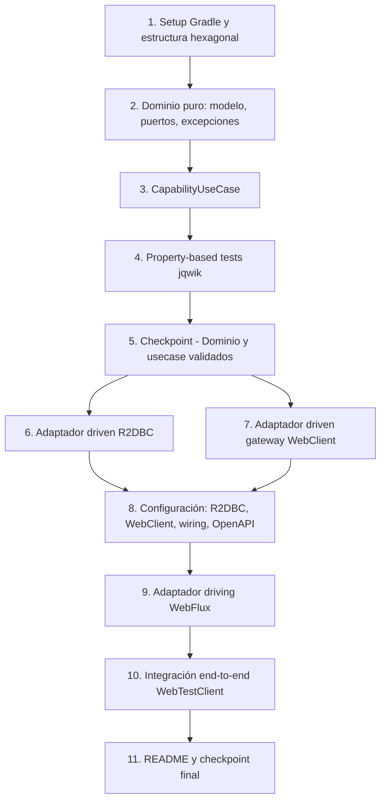

# Implementation Plan: Registrar Capacidades

## Overview

Plan de implementación incremental para la HU 2 - Registrar Capacidades, un microservicio reactivo (Java 17, Spring Boot 3, Spring WebFlux, Spring Data R2DBC + MySQL, WebClient, Gradle) con arquitectura hexagonal estricta. El plan avanza capa por capa: setup del proyecto, dominio puro, caso de uso con validaciones reactivas (incluyendo la consulta al microservicio de Tecnología vía gateway), adaptadores driven (R2DBC + gateway HTTP), configuración (transaccionalidad, WebClient, wiring, OpenAPI) y adaptador driving WebFlux, cerrando con integración end-to-end. Cada regla de negocio queda cubierta por tests unitarios (JUnit 5 + Mockito + StepVerifier), property-based tests (jqwik, 10 propiedades) y tests de integración (WebTestClient + Testcontainers MySQL, con el Technology_Service simulado).

Los tipos reactivos (`Mono`/`Flux`) se usan de extremo a extremo sin llamadas bloqueantes (`.block()`), cumpliendo el Requerimiento 8.

## Task Dependency Graph

Notas sobre el grafo:
- La tarea 1 (setup) es prerrequisito de todo el trabajo posterior.
- El dominio (2), el usecase (3) y sus tests (4) se construyen de forma estrictamente secuencial, cerrando con el checkpoint (5).
- Tras el checkpoint, los adaptadores driven R2DBC (6) y gateway (7) pueden desarrollarse en paralelo.
- La configuración (8) hace el wiring de ambos adaptadores, por lo que depende de 6 y 7.
- El adaptador driving (9), la integración end-to-end (10) y el cierre (11) siguen de forma secuencial.

## Tasks

- [x] 1. Setup del proyecto Gradle y estructura hexagonal
  - [x] 1.1 Crear `build.gradle`, `settings.gradle` y wrapper de Gradle
    - Plugins: `org.springframework.boot`, `io.spring.dependency-management`, `java`; toolchain Java 17
    - Runtime: `spring-boot-starter-webflux`, `spring-boot-starter-data-r2dbc`, `io.asyncer:r2dbc-mysql`, `org.springdoc:springdoc-openapi-starter-webflux-ui`, `lombok` (opcional)
    - Test: `spring-boot-starter-test`, `reactor-test`, `net.jqwik:jqwik`, `spring-boot-testcontainers`, `org.testcontainers:{mysql,junit-jupiter,r2dbc}`, `com.squareup.okhttp3:mockwebserver` (para simular el Technology_Service)
    - Configurar `test { useJUnitPlatform { includeEngines 'junit-jupiter','jqwik' } }` y el pin de la API de Docker (replicar `microservicio_tecnologia`)
    - _Requirements: 8.1, 8.2, 9.1_

  - [x] 1.2 Crear la estructura de paquetes hexagonal y la clase principal
    - Paquetes `domain.{model,api,spi,usecase,exception}`, `infrastructure.adapters.driven.{r2dbc.{entity,repository,adapter,mapper}, http}`, `infrastructure.adapters.driving.webflux.{router,handler,dto,mapper,exception}`, `application.config`
    - Clase `CapabilityApplication` con `@SpringBootApplication`
    - _Requirements: 8.1_

  - [x] 1.3 Crear `application.yml` y `schema.sql`
    - `spring.r2dbc.*` parametrizado por `DB_*`; `spring.sql.init.mode=always`, `schema-locations: classpath:schema.sql`; pool R2DBC
    - `technology.service.url` parametrizado por `TECHNOLOGY_SERVICE_URL` (default `http://localhost:8080`)
    - `schema.sql` con tablas `capability` (uq_capability_name) y `capability_technology` (PK compuesta, FK a capability)
    - _Requirements: 1.2, 3.2, 4.2, 6.1_

- [x] 2. Implementar el dominio puro (modelo, puertos, excepciones)
  - [x] 2.1 Implementar el modelo `Capability`
    - Inmutable, sin anotaciones: `id` (Long, null antes de persistir), `name`, `description`, `technologyIds` (List<Long>); constructor + getters
    - _Requirements: 1.1_

  - [x] 2.2 Definir puertos
    - `ICapabilityServicePort` (api): `Mono<Capability> registerCapability(Capability)`
    - `ICapabilityPersistencePort` (spi): `Mono<Boolean> existsByNameIgnoreCase(String)`, `Mono<Capability> save(Capability)`
    - `ITechnologyGatewayPort` (spi): `Flux<Long> findExistingTechnologyIds(Collection<Long>)`
    - _Requirements: 1.1, 1.2, 2.1, 7.1_

  - [x] 2.3 Implementar excepciones de dominio y `DomainErrorCode`
    - `DomainErrorCode`: `NAME_REQUIRED`, `NAME_TOO_LONG`, `DESCRIPTION_REQUIRED`, `DESCRIPTION_TOO_LONG`, `TECHNOLOGIES_TOO_FEW`, `TECHNOLOGIES_TOO_MANY`, `TECHNOLOGIES_DUPLICATED`
    - `InvalidCapabilityDataException(DomainErrorCode)`, `CapabilityAlreadyExistsException(name)`, `TechnologiesNotFoundException(List<Long>)`, `TechnologyValidationUnavailableException(cause)`
    - Excepciones puras, sin HTTP
    - _Requirements: 2.3, 3.1, 3.2, 4.1, 4.2, 5.1, 5.2, 6.1, 7.2, 7.4_

- [x] 3. Implementar el caso de uso `CapabilityUseCase`
  - [x] 3.1 Implementar `validate` (normalización + sintaxis + cantidad + no repetición)
    - trim de nombre/descripción; obligatoriedad y longitudes; normalizar ids (descartar nulls); detectar duplicados (tamaño lista vs conjunto); cantidad 3-20; emitir `Capability` normalizado
    - _Requirements: 3.1, 3.2, 3.3, 3.4, 4.1, 4.2, 4.3, 4.4, 5.1, 5.2, 5.3, 6.1, 6.2_

  - [x] 3.2 Implementar `ensureNameIsUnique`, `ensureTechnologiesExist` y `registerCapability`
    - `ensureNameIsUnique`: `existsByNameIgnoreCase`; si existe -> error 409
    - `ensureTechnologiesExist`: `gateway.findExistingTechnologyIds(...).collectList()`, calcular faltantes; si hay faltantes -> `TechnologiesNotFoundException`; propagar `TechnologyValidationUnavailableException`
    - `registerCapability`: `validate -> ensureNameIsUnique -> ensureTechnologiesExist -> save`, cortocircuitando ante error; sin `.block()`
    - _Requirements: 1.1, 2.1, 2.2, 2.4, 7.1, 7.2, 7.3, 8.1, 8.2_

  - [x] 3.3 Tests unitarios del usecase (StepVerifier/Mockito)
    - Ejemplos y bordes de todas las reglas; `verify(persistencePort, never()).save(any())` ante rechazo; mockear ambos puertos SPI
    - _Requirements: 1.1, 2.1, 2.2, 2.4, 3.*, 4.*, 5.*, 6.*, 7.*_

- [x] 4. Property-based tests (jqwik) para las 10 correctness properties
  - [x] 4.1 Property 1: registro válido conserva datos normalizados y persiste
    - **Feature: registrar-capacidades, Property 1** — **Validates: Requirements 1.1, 2.4, 3.3, 4.3, 5.3, 6.2, 7.3**
  - [x] 4.2 Property 2: nombre duplicado se rechaza sin persistir
    - **Feature: registrar-capacidades, Property 2** — **Validates: Requirements 2.1, 2.2, 2.3**
  - [x] 4.3 Property 3: normalización por trim idempotente
    - **Feature: registrar-capacidades, Property 3** — **Validates: Requirements 3.3, 4.4**
  - [x] 4.4 Property 4: nombre vacío/obligatorio rechazado sin persistir
    - **Feature: registrar-capacidades, Property 4** — **Validates: Requirements 3.1, 3.4**
  - [x] 4.5 Property 5: descripción vacía/obligatoria rechazada sin persistir
    - **Feature: registrar-capacidades, Property 5** — **Validates: Requirements 4.1**
  - [x] 4.6 Property 6: nombre > 50 o descripción > 90 rechazados sin persistir
    - **Feature: registrar-capacidades, Property 6** — **Validates: Requirements 3.2, 4.2**
  - [x] 4.7 Property 7: cantidad de tecnologías fuera de rango rechazada sin persistir
    - **Feature: registrar-capacidades, Property 7** — **Validates: Requirements 5.1, 5.2**
  - [x] 4.8 Property 8: tecnologías repetidas rechazadas sin persistir
    - **Feature: registrar-capacidades, Property 8** — **Validates: Requirements 6.1**
  - [x] 4.9 Property 9: tecnología inexistente rechaza el registro sin persistir
    - **Feature: registrar-capacidades, Property 9** — **Validates: Requirements 7.1, 7.2**
  - [x] 4.10 Property 10: invariante de no persistencia ante cualquier error
    - **Feature: registrar-capacidades, Property 10** — **Validates: Requirements 2.2, 3.4, 4.1, 4.2, 5.1, 5.2, 6.1, 7.2**

- [x] 5. Checkpoint - Dominio y usecase validados
  - Ensure all tests pass, ask the user if questions arise.

- [x] 6. Implementar el adaptador driven R2DBC
  - [x] 6.1 Entidades y repositorios
    - `CapabilityEntity` (@Table("capability")), `CapabilityTechnologyEntity` (@Table("capability_technology"))
    - `ICapabilityRepository extends ReactiveCrudRepository<CapabilityEntity, Long>` con `Mono<Boolean> existsByNameIgnoreCase(String)`
    - `ICapabilityTechnologyRepository extends ReactiveCrudRepository<CapabilityTechnologyEntity, ...>` con consultas por `capabilityId`
    - _Requirements: 1.2, 2.1, 6.1_
  - [x] 6.2 `CapabilityEntityMapper` (conversiones puras dominio<->entidad)
    - _Requirements: 1.2, 1.3_
  - [x] 6.3 `CapabilityPersistenceAdapter`
    - `existsByNameIgnoreCase` delega en el repo; `save` persiste capability y luego las asociaciones, envuelto en `TransactionalOperator`; `onErrorMap(DataIntegrityViolationException -> CapabilityAlreadyExistsException)`
    - _Requirements: 1.2, 1.3, 2.3, 8.1, 8.2_
  - [x] 6.4 Tests de integración del adaptador con Testcontainers MySQL
    - `save` persiste capacidad + asociaciones y retorna id; `existsByNameIgnoreCase` case-insensitive; nombre duplicado -> `CapabilityAlreadyExistsException`; verificar con `StepVerifier`
    - _Requirements: 1.2, 1.3, 2.1, 2.3_

- [x] 7. Implementar el adaptador driven gateway (WebClient)
  - [x] 7.1 `TechnologyGatewayResponse` (DTO) y `TechnologyGatewayAdapter`
    - `findExistingTechnologyIds`: arma `?ids=csv`, `bodyToFlux`, mapea a `id`; `Flux.empty()` si ids vacío; `onErrorMap -> TechnologyValidationUnavailableException`
    - _Requirements: 7.1, 7.4, 8.3_
  - [x] 7.2 Tests del gateway con MockWebServer
    - Respuesta con subconjunto de ids -> emite solo existentes; error 5xx/timeout -> `TechnologyValidationUnavailableException`; verificar con `StepVerifier`
    - _Requirements: 7.1, 7.2, 7.4_

- [x] 8. Implementar la configuración
  - [x] 8.1 `R2dbcConfig` (ReactiveTransactionManager + TransactionalOperator)
    - _Requirements: 1.2, 8.1, 8.2_
  - [x] 8.2 `WebClientConfig` (bean WebClient con baseUrl del Technology_Service)
    - _Requirements: 7.1, 8.3_
  - [x] 8.3 `BeanConfiguration` (wiring: persistence adapter, gateway adapter, usecase, handler)
    - _Requirements: 1.1, 1.2, 7.1_
  - [x] 8.4 `OpenApiConfiguration` (bean OpenAPI "Capability Service API")
    - _Requirements: 9.1_

- [x] 9. Implementar el adaptador driving WebFlux
  - [x] 9.1 DTOs (`CapabilityRequest`, `CapabilityResponse`, `ErrorResponse`) y `CapabilityDtoMapper`
    - _Requirements: 1.3, 2.3_
  - [x] 9.2 `CapabilityHandler.register`
    - `bodyToMono -> map(toDomain) -> flatMap(registerCapability) -> map(toResponse) -> 201`; errores al handler global
    - _Requirements: 1.3, 8.1, 8.2_
  - [x] 9.3 `CapabilityRouter` con doc OpenAPI (`@RouterOperation`)
    - `POST /api/v1/capabilities`; request `CapabilityRequest`, response 201 `CapabilityResponse`, errores 400/409/502 `ErrorResponse`
    - _Requirements: 1.3, 9.1_
  - [x] 9.4 `GlobalErrorWebExceptionHandler` (`@Order(-2)`)
    - Traduce: `InvalidCapabilityDataException`/`TechnologiesNotFoundException` -> 400, `CapabilityAlreadyExistsException` -> 409, `TechnologyValidationUnavailableException` -> 502, `ServerWebInputException` -> 400, otras -> 500
    - _Requirements: 2.3, 3.*, 4.*, 5.*, 6.1, 7.2, 7.4_

- [x] 10. Integración end-to-end del endpoint (WebTestClient)
  - [x] 10.1 Tests de integración del endpoint con WebTestClient + Testcontainers MySQL + MockWebServer
    - POST válido -> 201; nombre duplicado -> 409; nombre/descripción inválidos -> 400; <3 o >20 tecnologías -> 400; repetidos -> 400; tecnología inexistente -> 400; Technology_Service caído -> 502
    - _Requirements: 1.3, 2.3, 3.1, 3.2, 4.1, 4.2, 5.1, 5.2, 6.1, 7.2, 7.4_

- [x] 11. README y checkpoint final
  - [x] 11.1 README del microservicio (funcionalidad, arquitectura hexagonal, Mono/Flux y operadores, WebClient, recorrido de una petición, reglas de negocio, API REST, pruebas)
    - _Requirements: 9.1_
  - [x] 11.2 Checkpoint final - Ensure all tests pass
    - Ensure all tests pass, ask the user if questions arise.

## Notes

- Las tareas marcadas con `*` son opcionales (tests) pero el reto exige tests para cada regla de negocio.
- Cada tarea referencia requerimientos para trazabilidad; las tareas de propiedad referencian la propiedad y la cláusula de requisitos que validan.
- Regla de oro reactiva: nunca `.block()` en `src/main`; todo se compone con operadores de Project Reactor (Req 8).
- El Technology_Service se simula en los tests (MockWebServer) para no acoplar la suite al otro microservicio.
